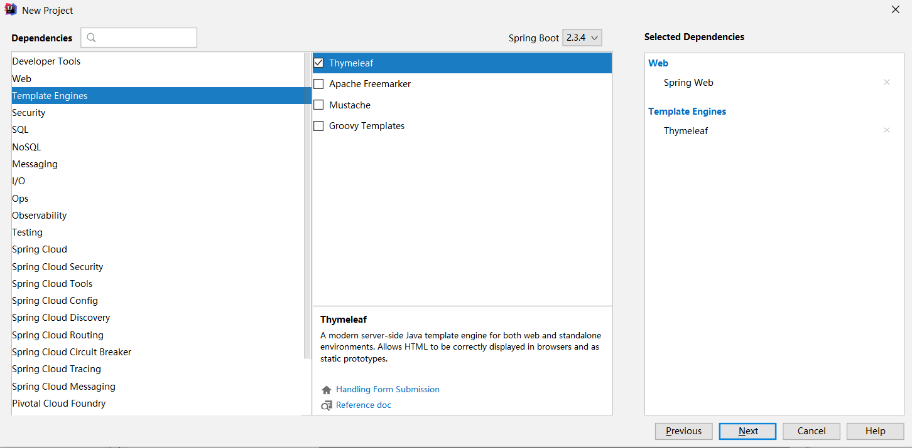
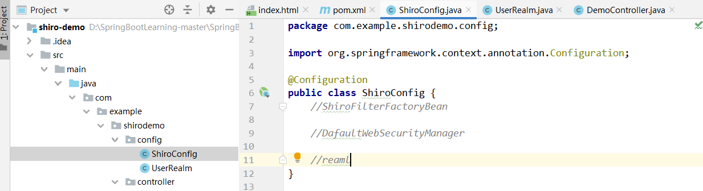
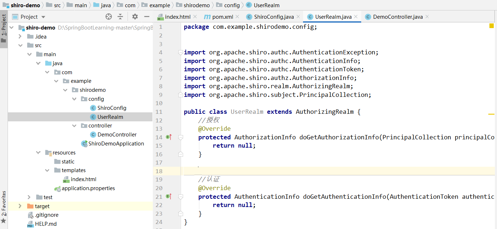
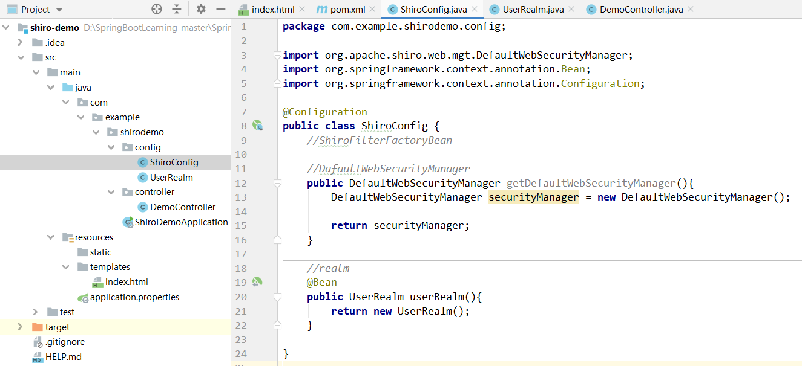
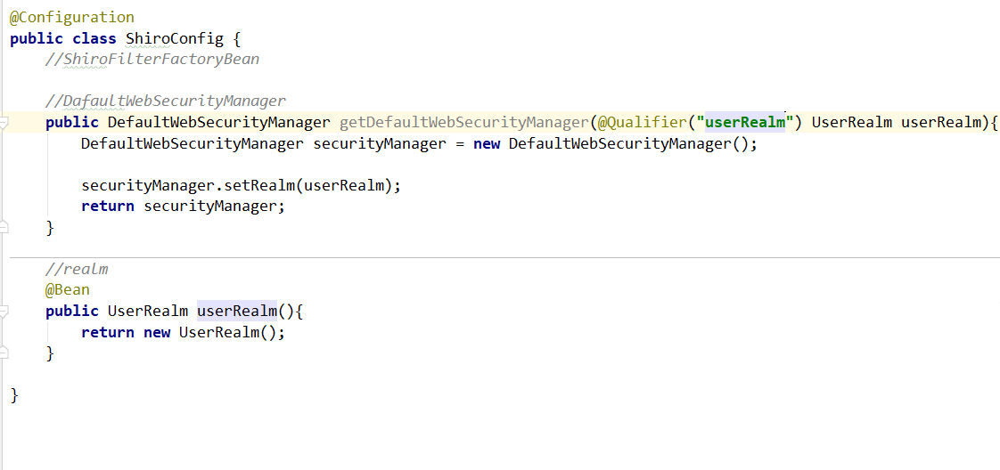
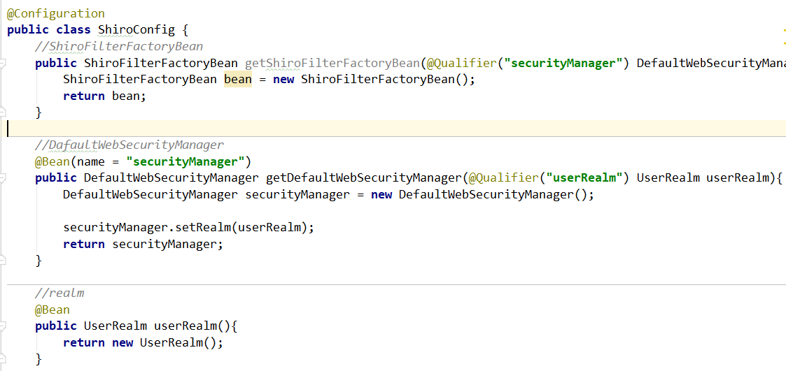
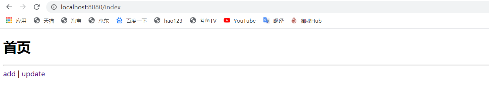
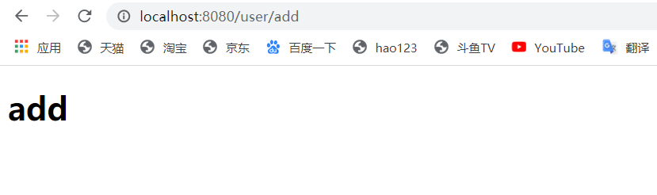
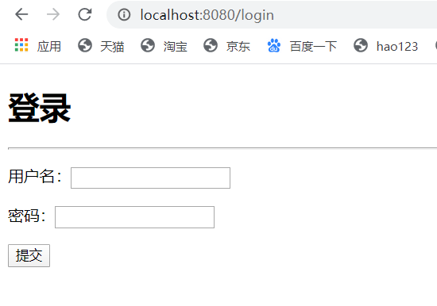
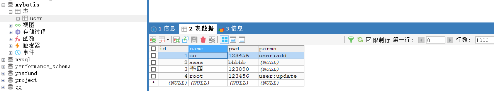

# 9.shiro认证与授权

### 9.1 简介：

Apache Shiro 是一个强大易用的 Java 安全框架，提供了认证、授权、加密和会话管理等功能，对于任何一个应用程序，Shiro 都可以提供全面的安全管理服务。并且相对于其他安全框架，Shiro 要简单的多。

### 9.2 功能模块介绍：

其基本功能点如下图所示：


Authentication：身份认证 / 登录，验证用户是不是拥有相应的身份；

Authorization：授权，即权限验证，验证某个已认证的用户是否拥有某个权限；即判断用户是否能做事情，常见的如：验证某个用户是否拥有某个角色。或者细粒度的验证某个用户对某个资源是否具有某个权限；

Session Management：会话管理，即用户登录后就是一次会话，在没有退出之前，它的所有信息都在会话中；会话可以是普通 JavaSE 环境的，也可以是如 Web 环境的；

Cryptography：加密，保护数据的安全性，如密码加密存储到数据库，而不是明文存储；

Web Support：Web 支持，可以非常容易的集成到 Web 环境；

Caching：缓存，比如用户登录后，其用户信息、拥有的角色 / 权限不必每次去查，这样可以提高效率；

Concurrency：shiro 支持多线程应用的并发验证，即如在一个线程中开启另一个线程，能把权限自动传播过去；

Testing：提供测试支持；

Run As：允许一个用户假装为另一个用户（如果他们允许）的身份进行访问；

Remember Me：记住我，这个是非常常见的功能，即一次登录后，下次再来的话不用登录了。

### 9.3 shiro实现验证和授权

#### 9.3.1 建立项目

1.添加web和thymeleaf依赖



2.pom文件中添加shiro整合spring依赖

```
<dependency>
            <groupId>org.apache.shiro</groupId>
            <artifactId>shiro-spring</artifactId>
            <version>1.6.0</version>
        </dependency>

```

#### 9.3.2 编写shiro配置类

1.新建config包，包下新建ShiroConfig类

  类用于创建shiro三大核心对象subject,manager,reaml类的实现



2.先自定义realm对象,config包下新建UserRealm类

自定义的UserRealm继承AuthorizingRealm 用于重写认证和授权方法（ctrl+i重写方法）



3.把userrealm注入bean中

shiroconfig中自下而上realm->manager->factorybean的顺序写



```
 //realm
    @Bean
    public UserRealm userRealm(){
        return new UserRealm();
    }
```


manager关联userRealm



```
 //DafaultWebSecurityManager
    @Bean(name = "securityManager")
    public DefaultWebSecurityManager getDefaultWebSecurityManager(@Qualifier("userRealm") UserRealm userRealm){
        DefaultWebSecurityManager securityManager = new DefaultWebSecurityManager();

        securityManager.setRealm(userRealm);
        return securityManager;
    }
```


同样方法factorybean关联manager



```
 //ShiroFilterFactoryBean
    @Bean
    public ShiroFilterFactoryBean getShiroFilterFactoryBean(@Qualifier("securityManager") DefaultWebSecurityManager defaultWebSecurityManager){
        ShiroFilterFactoryBean bean = new ShiroFilterFactoryBean();
        bean.setSecurityManager(defaultWebSecurityManager);
        return bean;
    }
```

#### 9.3.3 登录拦截

1.resource->templates下新建主页面index.html，login.html页面，新建user文件夹下建立用于测试的功能页面add.html和update.html

index

```
<!DOCTYPE html>
<html lang="en" xmlns:th="http://www.thymeleaf.org">
<head>
    <meta charset="UTF-8">
    <title>Title</title>
</head>
<body>
<h1>首页</h1>
<hr>
<a th:href="@{/user/add}">add</a> | <a th:href="@{/user/update}">update</a>
</body>
</html>
```

add

```
<!DOCTYPE html>
<html lang="en">
<head>
    <meta charset="UTF-8">
    <title>Title</title>
</head>
<body>
<h1>add</h1>
</body>
</html>
```

update

```
<!DOCTYPE html>
<html lang="en">
<head>
    <meta charset="UTF-8">
    <title>Title</title>
</head>
<body>
<h1>update</h1>
</body>
</html>
```

update

```
<html lang="en" xmlns:th="http://www.thymeleaf.org">
<head>
    <meta charset="UTF-8">
    <title>登录</title>
</head>
<body>
<h1>登录</h1>
<hr>
<p th:text="${msg}" style="color: red;"></p>
<form th:action="@{/login}">
    <p>用户名：<input type="text" name="username"></p>
    <p>密码：<input type="text" name="password"></p>
    <p><input type="submit"></p>
</form>

</body>
</html>
```

2. shiro 权限

   ```
   /*
   * anon:无需认证就可以访问
   * authc:必须认证了才能访问
   * user:必须拥有 记住我 功能才能用
   * perms: 拥有对某个资源的权限才能访问
   * role:拥有某个角色权限才能访问
   * */
   ```

3.设置拦截和登录请求

拦截user下的页面请求，跳转到login页面

```
    @Bean
    public ShiroFilterFactoryBean getShiroFilterFactoryBean(@Qualifier("securityManager") DefaultWebSecurityManager defaultWebSecurityManager){
        ShiroFilterFactoryBean bean = new ShiroFilterFactoryBean();
        bean.setSecurityManager(defaultWebSecurityManager);

        Map<String,String> filterMap = new LinkedHashMap<>();
        filterMap.put("/user/*","authc");
        bean.setFilterChainDefinitionMap(filterMap);

        bean.setLoginUrl("/login");
        return bean;
    }
```

拦截前的页面



进入add页面



拦截后的页面

进入add页面，自动拦截跳转到login登录页面



#### 9.3.4 认证

1.导入依赖

```
 <!--配置lombok-->
        <dependency>
            <groupId>org.projectlombok</groupId>
            <artifactId>lombok</artifactId>

        </dependency>
        
      	        <!--
        添加MySQL、mybatis、druid数据源
        -->
        <dependency>
            <groupId>mysql</groupId>
            <artifactId>mysql-connector-java</artifactId>
        </dependency>
        <dependency>
            <groupId>log4j</groupId>
            <artifactId>log4j</artifactId>
            <version>1.2.17</version>
        </dependency>
        <dependency>
            <groupId>com.alibaba</groupId>
            <artifactId>druid</artifactId>
            <version>1.2.1</version>
        </dependency>
        <dependency>
            <groupId>org.mybatis.spring.boot</groupId>
            <artifactId>mybatis-spring-boot-starter</artifactId>
            <version>2.1.3</version>
        </dependency>
```

2.新建数据库名为mybatis，在该数据库下新建user表



3.yml文件配置

```
spring:
  datasource:
    username: root
    password: 123
    #?serverTimezone=UTC解决时区的报错
    url: jdbc:mysql://localhost:3306/mybatis?serverTimezone=UTC&useUnicode=true&characterEncoding=utf-8
    driver-class-name: com.mysql.cj.jdbc.Driver
    type: com.alibaba.druid.pool.DruidDataSource

    #Spring Boot 默认是不注入这些属性值的，需要自己绑定
    #druid 数据源专有配置
    initialSize: 5
    minIdle: 5
    maxActive: 20
    maxWait: 60000
    timeBetweenEvictionRunsMillis: 60000
    minEvictableIdleTimeMillis: 300000
    validationQuery: SELECT 1 FROM DUAL
    testWhileIdle: true
    testOnBorrow: false
    testOnReturn: false
    poolPreparedStatements: true

    #配置监控统计拦截的filters，stat:监控统计、log4j：日志记录、wall：防御sql注入
    #如果允许时报错  java.lang.ClassNotFoundException: org.apache.log4j.Priority
    #则导入 log4j 依赖即可，Maven 地址：https://mvnrepository.com/artifact/log4j/log4j
    filters: stat,wall,log4j
    maxPoolPreparedStatementPerConnectionSize: 20
    useGlobalDataSourceStat: true
    connectionProperties: druid.stat.mergeSql=true;druid.stat.slowSqlMillis=500
```

4.properties 配置

```
mybatis.type-aliases-package=com.ku.pojo
mybatis.mapper-locations=classpath:mapper/*.xml
```

5.根据数据库构造user类，采用lombok注解构造有参和无参

```
package com.ku.pojo;

import lombok.AllArgsConstructor;
import lombok.Data;
import lombok.NoArgsConstructor;

//Dao层
//lombok注解
@Data
@AllArgsConstructor  //有参
@NoArgsConstructor   //无参
public class User {
    private int id;
    private String name;
    private String pwd;
    private String perms;
}

```

6.在resources目录下新建mapper文件夹，构造UserMapper.xml文件，根据name查询数据库

```
<?xml version="1.0" encoding="UTF-8" ?>
<!DOCTYPE mapper
        PUBLIC "-//mybatis.org//DTD Mapper 3.0//EN"
        "http://mybatis.org/dtd/mybatis-3-mapper.dtd">

<mapper namespace="com.ku.mapper.UserMapper">

    <select id="queryUserByName" parameterType="String" resultType="User">
       select * from mybatis.user where name = #{name}
    </select>


</mapper>
```

7.service目录下创建userService 接口和其实现类UserServiceImpl用于实现queryUserByName方法

userService

```
package com.ku.service;

import com.ku.pojo.User;

public interface UserService {
    public User queryUserByName(String name);
}

```

UserServiceImpl

```
package com.ku.service;

import com.ku.mapper.UserMapper;
import com.ku.pojo.User;
import org.springframework.beans.factory.annotation.Autowired;
import org.springframework.stereotype.Service;

@Service
public class UserServiceImpl implements UserService{
    @Autowired
    UserMapper userMapper;

    @Override
    public User queryUserByName(String name){
        return userMapper.queryUserByName(name);
    }
}

```

8.controller类中获取当前用户信息

```
    @RequestMapping("/login")
    public String login(String username,String password,Model model){
        //获取当前的用户
        Subject subject = SecurityUtils.getSubject();
        //封装用户的登录数据
        UsernamePasswordToken token = new UsernamePasswordToken(username, password);
        //执行登录的方法，如果没有异常就说明OK了
        try{
            subject.login(token);
            return "index";
        }catch(UnknownAccountException e){
            model.addAttribute("msg","用户名错误");
            return "login";
        }catch(IncorrectCredentialsException e) {
            model.addAttribute("msg", "密码错误");
            return "login";
        }

```

9.UserRealm中根据用户名查询密码进行匹配

```
    //认证
    @Override
    protected AuthenticationInfo doGetAuthenticationInfo(AuthenticationToken token) throws AuthenticationException {
        System.out.println("执行了=>授权doGetAuthenticationInfo")
        UsernamePasswordToken userToken = (UsernamePasswordToken) token;
        //连接数据库
        User user = userService.queryUserByName(userToken.getUsername());
        if(user==null){//如果没有这个用户返回UnknownAccountException
            return null;
        }

        //密码认证，shiro自己做
        return new SimpleAuthenticationInfo(user,user.getPwd(),"");
    }
}

```

#### 9.3.5 授权

1.controller类添加未授权跳转页面

```
    @RequestMapping("/noauth")
    @ResponseBody
    public String unauthorized(){
        return "未经授权无法访问此页面";
    }
```

2.shiroconfig中对页面进行权限设置，只有拥有add权限的用户才能进入add页面，只有拥有update权限的用户才能进入update页面，没有权限会跳转到noauth未授权页面

```
  //shirofilterfactorbean:3
    @Bean
    public ShiroFilterFactoryBean getShiroFilterFactoryBean(@Qualifier("securityManager") DefaultWebSecurityManager defaultWebSecurityManager){
        ShiroFilterFactoryBean bean = new ShiroFilterFactoryBean();
        //设置安全管理器
        bean.setSecurityManager(defaultWebSecurityManager);

        //添加shiro的内置过滤器
        /*
        * anon:无需认证就可以访问
        * authc:必须认证了才能访问
        * user:必须拥有 记住我 功能才能用
        * perms: 拥有对某个资源的权限才能访问
        * role:拥有某个角色权限才能访问
        * */
        //拦截
        Map<String , String> filterMap = new LinkedHashMap<>();

        //授权，正常的情况下，没有授权会跳转到未授权页面
        filterMap.put("/user/add","perms[user:add]");
        filterMap.put("/user/update","perms[user:update]");
//        filterMap.put("/user/add","authc");
//        filterMap.put("/user/update","authc");

        filterMap.put("/user/*","authc");

        bean.setFilterChainDefinitionMap(filterMap);
        //设置登录的请求
        bean.setLoginUrl("/toLogin");
        //未授权页面
        bean.setUnauthorizedUrl("/noauth");
        return bean;
    }
```

3.userrealm类中获取当前登录的对象和对象的权限

```
 //授权
    @Override
    protected AuthorizationInfo doGetAuthorizationInfo(PrincipalCollection principalCollection) {
        System.out.println("执行了=>授权doGetAuthorizationInfo");
        //SimpleAuthorizationInfo
        SimpleAuthorizationInfo info = new SimpleAuthorizationInfo();
        //info.addStringPermission("user:add");

        //拿到当前登录的这个对象
        Subject subject = SecurityUtils.getSubject();
        //拿到user对象
        User currentUser = (User) subject.getPrincipal();

        //设置当前用户的权限
        info.addStringPermission(currentUser.getPerms());

        return info;
    }
```

